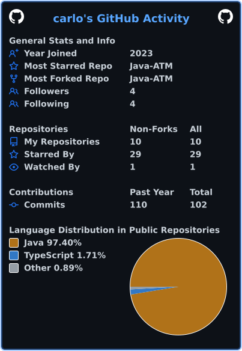

# 🧊 Hi, I'm Carlo

**IT Student | Web Development | Cybersecurity Enthusiast**

I'm a second-year Information Technology student at National University (MOA) and the Secretary of the IT Student Council. My foundation is in Mobile and Web Applications, but I'm currently shifting my focus toward cybersecurity, secure coding, and threat modeling. 

### 💻 Tech Stack & Tools

  
  
  
  
  

### 🚀 Current Projects & Focus
- **Active Development:** Currently working on building **QHOP** (a queueing management system for a school requirement!).
- **Web Development:** Building interactive apps, like a custom geometric tessellation generator using React and TypeScript.
- **Cybersecurity:** Exploring network security fundamentals and learning how to build more resilient systems.
- **Systems & Administration:** Writing object-oriented desktop GUIs in Apache NetBeans and managing backend stability for shared multiplayer servers.

### 🛡️ Currently Learning

  
  
  

### 🎧 Music Activity

  
  

### 📫 Let's Connect

  
  

### 📈 GitHub Stats

  

